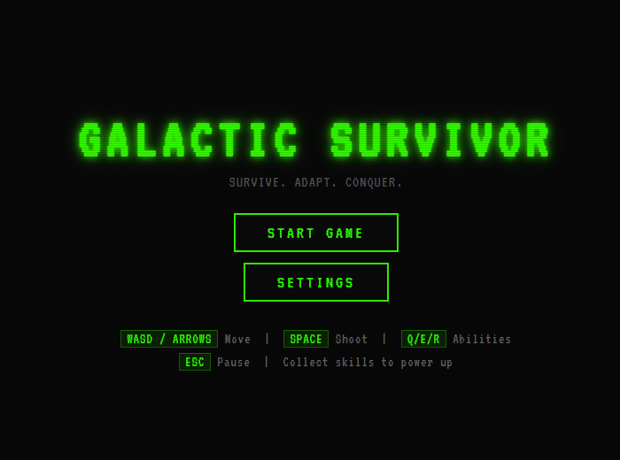
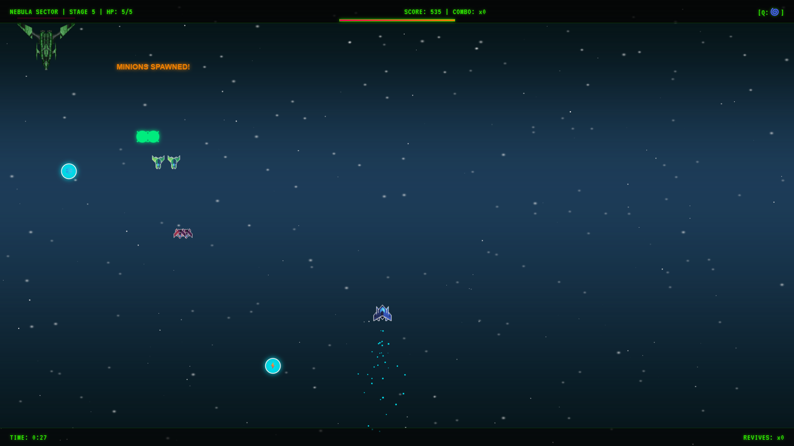
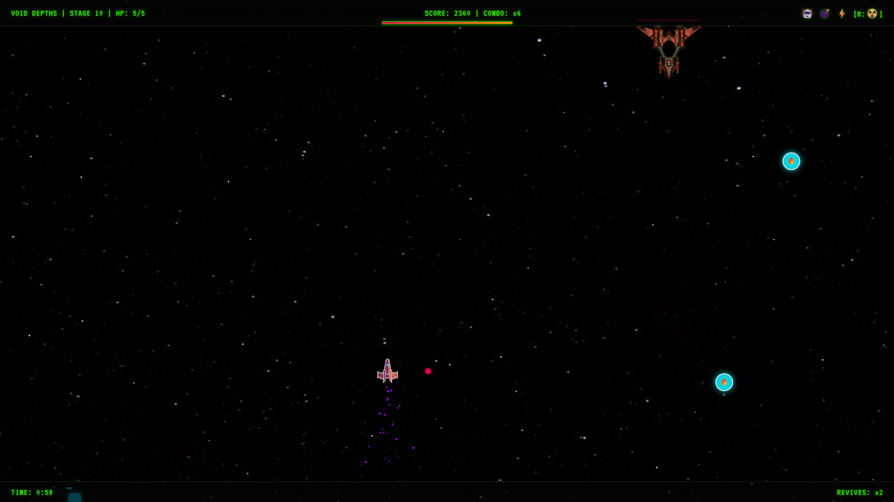
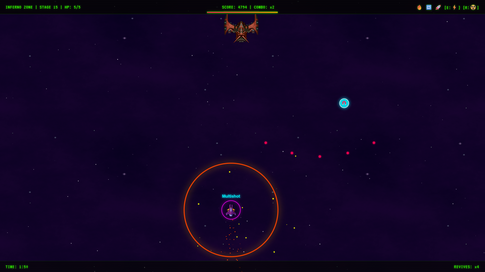
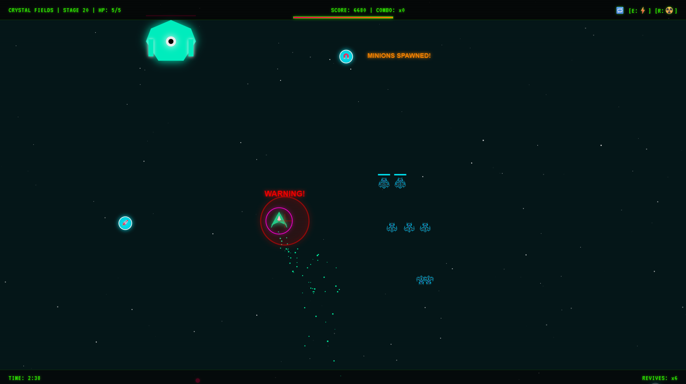
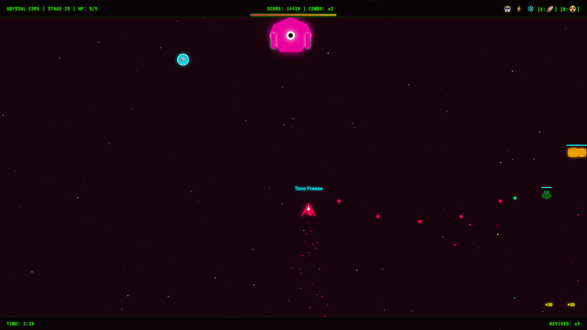
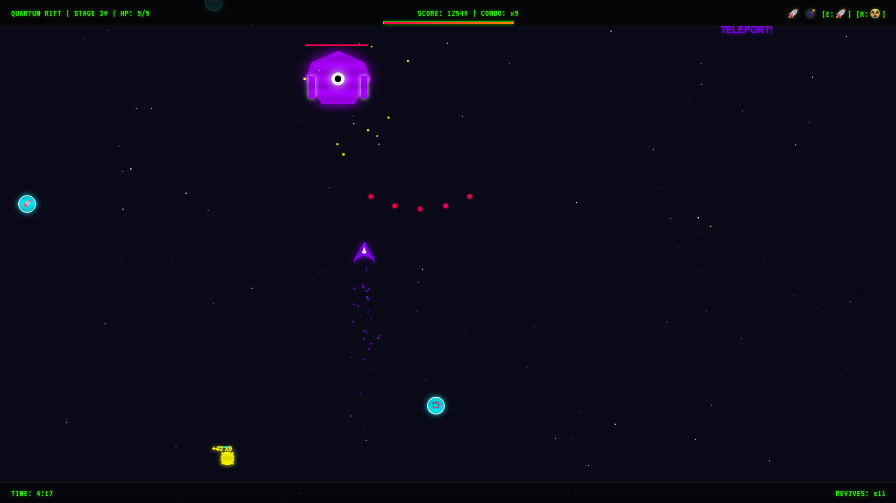
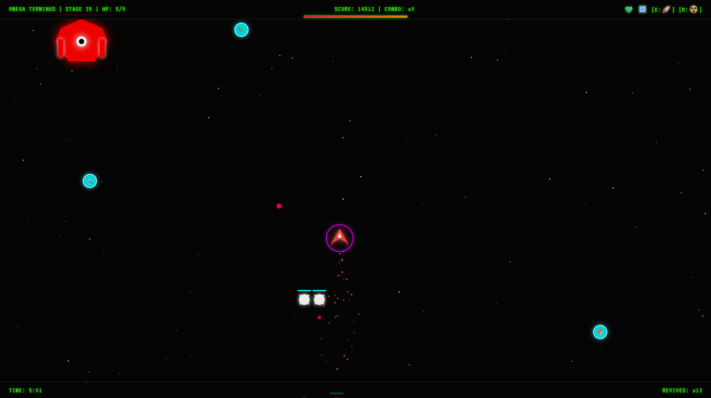
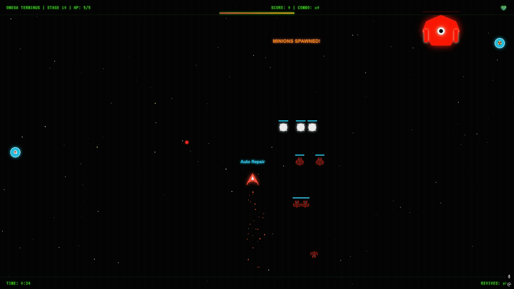

# 🚀 GALACTIC SURVIVOR

> **browser based space shooter game**

---

## What Is This?

**Galactic Survivor** is a browser-based space shooter/survivor game

7 galactic sectors, 25+ skills, unique boss mechanics for every area. The goal is simple: survive, stack combos, take down bosses, and conquer the galaxy.

To play Open `index.html` in any modern web browser or play the live demo!

---

## Features

- **🌌 7 Sectors (Areas)**  
  From Nebula Sector to Omega Terminus — each with its own enemy types, and boss mechanics.

- **⚔️ 25+ Skills & Abilities**  
  Passive skills (Multishot, Shield, Berserk, Homing...) and active abilities mapped to Q/E/R (Shockwave, Black Hole, Lightning, Nuke, Time Freeze...).

- **👹 Area Bosses**  
  Every 5th stage throws a massive boss at you with unique attack patterns: dash charges, 8-way bursts, fire rings, homing missiles, teleports, rage mode...

- **🔥 Combo System**  
  Chain enemy kills to build your combo multiplier. Take damage and it resets.

- **💀 Revives**  
  Spend collected revive tokens to come back.

- **🎵 7 Area Music Tracks**  
  Each sector has its own looping atmospheric track. SFX and volume controls included.

- **🛠️ Dev Mode**  
  Toggle it from Settings to spawn any boss, jump to any area, full heal, or wipe all enemies instantly.
  
-**💪 God Mode**
  Toggle it from Settings to become invincible.

---

## 🎮 How To Play

### Controls

| Key | Action |
|-----|--------|
| `WASD` / `Arrow Keys` | Move ship |
| `SPACE` | Shoot |
| `Q` | Active Ability 1 (Shockwave / Black Hole) |
| `E` | Active Ability 2 (Lightning / Mega Missile) |
| `R` | Active Ability 3 (Nuke / Chronostasis) |
| `ESC` | Pause / Cancel targeting |

### Game Flow

1. Shoot enemy ships, collect points and build combos.
2. Grab falling skill pickups (emoji icons) to power up.
3. Every 5th stage = **BOSS FIGHT**.
4. Defeat the boss to open a portal. Enter it to go to the next sector.
5. Clear all 7 sectors for **VICTORY**.

---

## 🌠 Sectors

| # | Sector | Accent Color | Boss Mechanic |
|---|--------|--------------|---------------|
| 1 | **NEBULA SECTOR** | `#00f0ff` Cyan / Purple | **Dash Charge**: Rushes toward the player |
| 2 | **VOID DEPTHS** | `#aa00ff` Purple / Black | **8-Way Burst**: Fires 8 simultaneous bullets in all directions |
| 3 | **INFERNO ZONE** | `#ff4500` Orange / Red | **Inferno Ring**: Creates a ring of fire around itself |
| 4 | **CRYSTAL FIELDS** | `#00ffaa` Green / Cyan | **Meteor Strike**: Rains fireballs on target (warning → explosion) |
| 5 | **ABYSSAL CORE** | `#ff0055` Pink / Red | **Homing Missiles**: Launches tracking missiles |
| 6 | **QUANTUM RIFT** | `#8800ff` Purple / Blue | **Teleport**: Warps to random positions |
| 7 | **OMEGA TERMINUS** | `#ff4444` Red / White | **Rage Mode**: Speed and attack rate increase drastically |

---

## ⚡ Skills & Abilities Guide

### Passive Skills (Timed Duration)

| Icon | Skill | Effect | Unlocked At |
|------|-------|--------|-------------|
| 🚀 | **Multishot** | Fires 5 bullets simultaneously | Area 1 |
| 🛡️ | **Shield** | Invincible to damage | Area 1 |
| ❤️ | **Health** | +1 HP | Area 1 |
| 👻 | **Ghost** | Enemies and bullets ignore you | Area 1 |
| 💣 | **Bomb Shot** | Explosive bullets | Area 1 |
| ⚡ | **Chain Laser** | Chain damage to enemies on same horizontal line | Area 1 |
| 🔫 | **Laser Beam** | Continuous beam attack | Area 1 |
| 🔥 | **Fire Ring** | Burns nearby enemies | Area 1 |
| ❄️ | **Time Freeze** | Freezes time briefly | Area 1 |
| 🔮 | **Plasma Aura** | Damages nearby enemies with plasma | Area 1 |
| 🤖 | **Combat Drone** | Auto-targeting drone bullets | Area 2 |
| 🔥 | **Rapid Fire** | Increased fire rate | Area 2 |
| 🧲 | **Item Magnet** | Pulls skill pickups toward you | Area 2 |
| 🔄 | **Reflect Shield** | Reflects enemy bullets back | Area 3 |
| ☠️ | **Toxic Aura** | Poison field, deals damage over time | Area 3 |
| 🎯 | **Homing** | Bullets track enemies | Area 4 |
| 💢 | **Berserk** | Speed + damage boost | Area 4 |
| 💚 | **Auto Repair** | +1 HP every 1.5 seconds | Area 5 |
| 🔥 | **Phoenix** | Gives you +1 revive token | Area 5 |

### Active Abilities (Q / E / R Slots)

| Slot | Ability | Effect | Unlocked At |
|------|---------|--------|-------------|
| **Q** | 🌀 **Shockwave** | Pushes all enemies back and halves their HP | Area 1 |
| **Q** | ⚫ **Black Hole** | Destroys all normal enemies within 350px radius | Area 6 |
| **E** | ⚡ **Lightning** | Click to strike, leaves 10s debuff on enemies | Area 1 |
| **E** | 🚀 **Mega Missile** | Fires a missile at every enemy on screen | Area 4 |
| **R** | ☢️ **Nuke** | Clears the entire screen, heavy boss damage | Area 1 |
| **R** | ⏱️ **Chronostasis** | Full time freeze for 5 seconds | Area 5 |

---

## 🧪 Dev Mode

Enable **Dev Mode** in Settings to access these shortcuts:

| Key | Action |
|-----|--------|
| `N` | Jump to next Area |
| `M` | Jump to next Stage |
| `B` | Instantly spawn a Boss |
| `H` | Full heal |
| `K` | Kill all enemies |

**God Mode** is also available: take zero damage, just watch and test.

